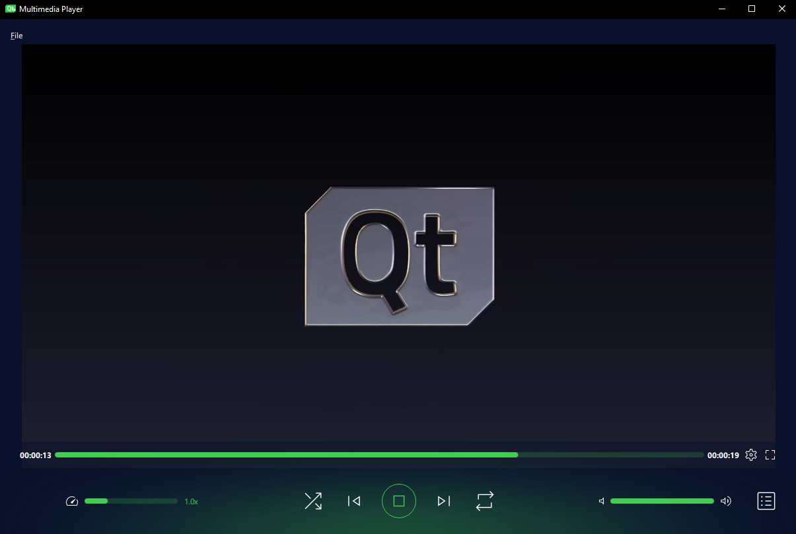

# Qt Multimedia Player
Turns an example media player from the [Qt documentation](https://doc.qt.io/qtforpython-6/examples/example_qtdemos_mediaplayer.html) into a full-fledged application.

  

## Screenshots


## Quick Start
### Source Code
1. **Clone the Repository**  
   Clone the project repository to your local machine:
   ```bash
   git clone https://github.com/deeffest/Qt-Multimedia-Player.git
   ```
2. **Navigate to the Project Directory**  
   Enter the project folder:
   ```bash
   cd Qt-Multimedia-Player
   ```
3. **Install Dependencies**  
   Install the required dependencies:
   ```bash
   pip install -r requirements.txt
   ```
4. **Run the Application**  
   Start the QMPlayer:
   ```bash
   python QMPlayer.py
   ```

### Ready-to-Use Builds
1. **Download the Latest Release**  
   Get the latest version for your OS from the [Releases page](https://github.com/deeffest/Qt-Multimedia-Player/releases/latest).

2. **Extract the Archive**  
   Unzip the downloaded archive to a location of your choice.

3. **Run the Application**  
   Open the extracted folder, then run the executable file to start the QMPlayer.

## See also
- [deeffest/DEEF-Lite-Media-Player](https://github.com/deeffest/DEEF-Lite-Media-Player)：Сross-platform media player. 
- [deeffest/DEEF-Lite-Image-Viewer](https://github.com/deeffest/DEEF-Lite-Image-Viewer)：Сross-platform image viewer.
- [deeffest/Youtube-Music-Desktop-Player](https://github.com/deeffest/Youtube-Music-Desktop-Player): Turns the YT Music site into a desktop application.

## License
The Qt Multimedia Player is distributed under the **GPLv3 license**.

## Disclaimer
This application is unofficial and not affiliated with The Qt Company. It was created using example code provided by The Qt Company, with custom modifications and enhancements, including a modified logo with a play symbol. "Qt" and the "Qt logo" are registered trademarks of The Qt Company.

**We’d love to hear your questions or suggestions!** 💬